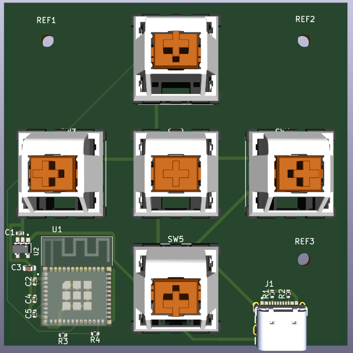
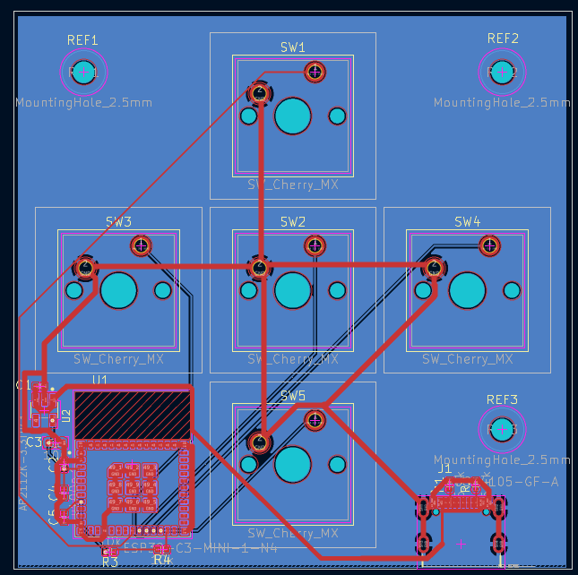

# Smart Tactile Controller

A five-key USB-C macro pad built around an ESP32-C3 — from KiCad schematic to fabricated PCB and 3D-printed enclosure.

<p align="center">
  
</p>

<p align="center">
  
  
</p>

---

## Overview

The Smart Tactile Controller is a compact 5-key macro pad powered by an **ESP32-C3-MINI-1** module, giving it onboard Wi-Fi and BLE for wireless macro/HID use in addition to wired USB-C. The full design — schematic, PCB layout, and enclosure — was taken from concept to a fabricated, assembled board.

## Key Specifications

| Property         | Value                                              |
| ----------------- | --------------------------------------------------- |
| MCU               | ESP32-C3-MINI-1 (RISC-V, Wi-Fi + BLE)               |
| Power             | USB-C input via AP2112K-3.3 LDO regulator            |
| Input             | 5 × Cherry MX–compatible mechanical switches         |
| PCB               | 2-layer, 58 × 85 mm, 0402/0603 SMD components        |
| Enclosure         | 3D-printed, custom-designed                          |
| Cost              | ~$5 per board (PCBWay)                               |

## Hardware Files

| File                                             | Description                                    |
| -------------------------------------------------- | ------------------------------------------------- |
| [`hardware/Smart_Tactile_Controller.kicad_sch`](hardware/Smart_Tactile_Controller.kicad_sch) | Full schematic (ESP32-C3, LDO regulator, USB-C, switch matrix) |
| [`hardware/Smart_Tactile_Controller.kicad_pcb`](hardware/Smart_Tactile_Controller.kicad_pcb) | Routed 2-layer PCB layout                        |
| [`hardware/Smart_Tactile_Controller_Print.stl`](hardware/Smart_Tactile_Controller_Print.stl) | 3D-printable enclosure                           |

Open the `.kicad_sch` / `.kicad_pcb` files in **KiCad 10** to view or edit the design. The `.stl` can be sliced directly for 3D printing.

## GitHub Pages Deployment

This repo can be hosted as a static project site via GitHub Pages:

1. Push to the `main` branch.
2. In the repo settings, go to **Pages** and set the source to `main` / root (or `/docs` if you move `index.html` there).
3. The site will be published at `https://iancho-eng.github.io/Smart-Tactile-Controller/`.

### Local Preview

To preview the site locally before pushing:

```bash
python3 -m http.server 8000
```

Then open `http://localhost:8000` in your browser.

## License

Consider adding a [CERN-OHL](https://cern-ohl.web.cern.ch/) or MIT license to make the hardware design freely reusable by others.

## Status

- [x] Schematic designed in KiCad
- [x] PCB routed (2-layer)
- [x] Enclosure designed and 3D printed
- [x] Board fabricated and assembled
- [ ] Firmware / HID mapping documented
